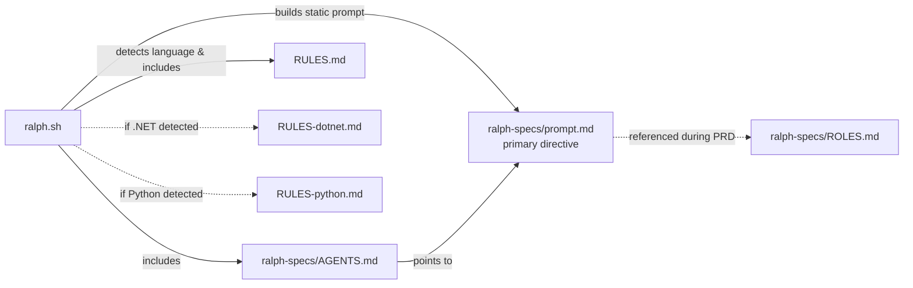

# Ralph


Ralph is an autonomous AI agent loop that runs coding tools ([OpenCode](https://opencode.ai), [Amp](https://ampcode.com), or [Claude Code](https://docs.anthropic.com/en/docs/claude-code)) repeatedly until all tasks are complete. Each iteration is a fresh instance with clean context. Memory persists via git history, `progress.md`, and `tasks.json`.

## Quick Start

This walkthrough creates a .NET console app from scratch using Ralph — from zero to working code in 5 minutes.

### 0. Prerequisites

**WSL (Windows users):** Ralph runs in a Linux shell. If you're on Windows, install [WSL 2](https://learn.microsoft.com/en-us/windows/wsl/install) first and run everything below inside your WSL distro:

```powershell
wsl --install
```

**Docker Desktop / Docker Compose:** Ralph runs all builds, tests, and installs inside containers. Install [Docker Desktop](https://docs.docker.com/desktop/) (Windows/Mac — includes Compose) or on Linux:

```bash
sudo apt install docker.io docker-compose-v2
sudo usermod -aG docker $USER   # then log out and back in
```

Verify with `docker compose version`.

**OpenCode:** Ralph's default AI coding tool. Install it inside WSL / your Linux shell:

```bash
curl -fsSL https://opencode.ai/install | bash
```

Verify with `opencode --version`. You also need `jq` and `git`:

```bash
sudo apt install jq git
```

### 1. Clone Ralph and create a project

```bash
# Clone Ralph
cd ~/projects
git clone https://github.com/blixgardhn/ralph.git

# Install skills
cd ralph
./scripts/install_ralph_skills.sh

# Create an empty project repo
cd ~/projects
mkdir hello-ralph && cd hello-ralph
git init
```

### 2. Configure OpenCode permissions

Create or edit `~/.config/opencode/opencode.json`:

```json
{
  "$schema": "https://opencode.ai/config.json",
  "model": "github-copilot/gpt-5.1-codex-max",
  "permission": {
    "external_directory": {
      "/home/<your-user>/projects/**": "allow"
    },
    "read": "allow",
    "list": "allow",
    "glob": "allow",
    "grep": "allow",
    "edit": "allow",
    "bash": "allow",
    "webfetch": "allow"
  }
}
```

Replace `<your-user>` with your actual username. All permissions must be `"allow"` — see [OpenCode Configuration](#opencode-configuration) for details.

If your org uses a TLS-intercepting proxy, private package feeds, or custom AI providers, see [Organization-specific settings](#organization-specific-settings).

### 3. Create a PRD

From inside your project directory, open OpenCode and describe what you want to build:

```bash
cd ~/projects/hello-ralph
opencode
```

```
Create a .NET 9 console app called HelloRalph that prompts the user for
their name and prints "Hello, <name>! Welcome to Ralph." Include an xUnit
test project that verifies the greeting output. The app and tests should
be runnable via docker compose (include a docker-compose.yml and Dockerfile).
```

The installed PRD skill triggers automatically. Answer the clarifying questions. When done, the skill produces `.ralph/tasks.json` with ordered, self-contained tasks. Review them (tip: `code .` opens VS Code if you want to look at the files), then exit OpenCode.

Or use the CLI one-liner:

```bash
cd ~/projects/hello-ralph
opencode run 'Create a .NET 9 console app called HelloRalph that prompts the user for their name and prints "Hello, <name>! Welcome to Ralph." Include an xUnit test project that verifies the greeting output. The app and tests should be runnable via docker compose (include a docker-compose.yml and Dockerfile).'
```

### 4. Run Ralph

```bash
cd ~/projects/hello-ralph
../ralph/ralph.sh
```

Ralph creates a feature branch, works through each task (scaffold, implement, build, test — all inside containers), and stops when all tasks pass. Watch the progress in the terminal.

When it finishes, check the result:

```bash
# See what Ralph built
git log --oneline

# Run the app
docker compose run --rm app

# Run the tests
docker compose run --rm test
```

## Prerequisites

See [Quick Start step 0](#0-prerequisites) for installation instructions. In summary:

- **WSL 2** (Windows users only)
- **Docker** with Compose support (`docker compose version` must work)
- **OpenCode CLI** ([opencode.ai](https://opencode.ai)) — or alternatively [Amp](https://ampcode.com) / [Claude Code](https://docs.anthropic.com/en/docs/claude-code)
- **jq** and **git**

## OpenCode Configuration

The minimal config is shown in the [Quick Start](#3-configure-opencode-permissions). Additional details:

- **All tool permissions must be `"allow"`.** If any permission is missing or set to `"deny"`, the agent will hang waiting for interactive approval that never comes in piped mode.
- **`external_directory`** — if your target repo is outside OpenCode's default working directory, add it here:
  ```json
  "external_directory": {
    "/path/to/your/projects/**": "allow"
  }
  ```
- **Model** — Ralph defaults to `github-copilot/gpt-5.1-codex-max`. Override with `--opencode-model <model>` or the `OPENCODE_MODEL` env var.
- **Custom providers** — you can add providers (OpenAI, Ollama, etc.) under the `"provider"` key. Keep API keys out of this file if you plan to share your config; use environment variables instead.
- **Duplicate JSON keys** — JSON parsers take the last value for duplicate keys. If you have per-path permission overrides, ensure they don't get silently overridden by a later blanket rule.

### Comparison with other tools

| Tool | Permission mechanism |
|------|---------------------|
| OpenCode | `~/.config/opencode/opencode.json` permissions block |
| Amp | `--dangerously-allow-all` flag (passed automatically by Ralph) |
| Claude Code | `--dangerously-skip-permissions` flag (passed automatically by Ralph) |

OpenCode is the only tool where permissions are configured externally rather than via a CLI flag. If Ralph hangs during an iteration with no output, check your permissions config first.

## Setup Details

The [Quick Start](#quick-start) covers the recommended setup (clone alongside + install skills). Additional notes:

Ralph resolves two path roots on startup:
- `RALPH_ROOT` — the Ralph checkout (instructions, prompts, rules, resources). Nothing is written here at runtime.
- `TARGET_REPO_ROOT` — your project repo. All artifacts (`.ralph/tasks.json`, `.ralph/progress.md`, commits) are written here.

### Manual skill installation

If you prefer to install skills for a single tool instead of using the installer:

```bash
# OpenCode
cp -r skills/prd ~/.config/opencode/skills/
cp -r skills/ralph_runner ~/.config/opencode/skills/

# Amp
cp -r skills/prd ~/.config/amp/skills/
cp -r skills/ralph_runner ~/.config/amp/skills/

# Claude Code
cp -r skills/prd ~/.claude/skills/
cp -r skills/ralph_runner ~/.claude/skills/
```

## Workflow Details

### Creating a PRD

Inside your AI coding tool, load the PRD skill:

```
Load the prd skill and create a PRD for [your feature description]
```

Answer the clarifying questions. The skill produces:
- `.ralph/prds/NNNN-prd-[feature-name].md` — the requirements document
- `.ralph/tasks.json` — tasks structured for autonomous execution

The PRD skill runs 8 specialized roles (clarification, scope, feasibility, codebase analysis, quality review, domain validation, and formatting) to produce well-ordered, self-contained tasks.

### Running Ralph

```bash
# OpenCode (default)
../ralph/ralph.sh --target-repo /path/to/your/project

# Amp
../ralph/ralph.sh --tool amp --target-repo /path/to/your/project

# Claude Code
../ralph/ralph.sh --tool claude --target-repo /path/to/your/project

# Host mode (skip containers, run tools directly on host)
../ralph/ralph.sh --host-mode --target-repo /path/to/your/project
```

### Flags

| Flag | Default | Description |
|------|---------|-------------|
| `--tool` | `opencode` | AI tool to use (`opencode`, `amp`, `claude`) |
| `--target-repo` | current directory | Path to the project repository |
| `--host-mode` | off | Skip container wrapping; run builds/tests directly on host |
| `--opencode-model` | `github-copilot/gpt-5.1-codex-max` | Override the OpenCode model |
| `[max_iterations]` | `30` | Maximum number of iterations |

### What Ralph does each iteration

1. Create/switch to the feature branch (from `branchName` in tasks.json)
2. Select the next unblocked task where `passes: false`
3. Inject the task JSON and recent progress into the prompt
4. Run the AI tool to implement the task
5. Verify (tests, typecheck, build — in containers by default)
6. Commit if checks pass
7. Mark the task `passes: true` in `.ralph/tasks.json`
8. Append learnings to `.ralph/progress.md`
9. Repeat until all tasks pass or max iterations reached

### Stop conditions

- **All tasks pass** — agent outputs `<promise>COMPLETE</promise>`, loop exits successfully.
- **Agent blocked** — agent outputs `<promise>STOP</promise>`, loop exits with what was tried.
- **Stuck task** — if the same task is selected 3 consecutive times without completing, Ralph halts to prevent infinite loops.
- **Max iterations** — hard limit (default 30).

## How It Works

### Fresh context per iteration

Each iteration spawns a new AI instance with clean context. The only memory between iterations is:
- Git history (commits from previous iterations)
- `.ralph/progress.md` (learnings and context)
- `.ralph/tasks.json` (which tasks are done)

### Small, self-contained tasks

Each task should be small enough to complete in one context window. The implementing agent receives only its assigned task JSON — it has no visibility into other tasks or the full PRD.

Right-sized tasks:
- Add a database column and migration
- Add a UI component to an existing page
- Update a server action with new logic

Too big (split these):
- "Build the entire dashboard"
- "Add authentication"
- "Refactor the API"

### Codebase pattern analysis

During PRD creation, the Codebase Pattern Analyst role reads your codebase and populates `keyFiles` and `implementationNotes` on each task. This lets the iteration agent skip file discovery and start implementing immediately.

### Containers

All installs, tests, builds, and seeding run in containers by default. Use `--host-mode` to bypass this when tools are installed locally. The Dockerfiles in `ralph-specs/resources/` support corporate CA certificates via build args:

```bash
docker build \
  --build-arg PROXY_CERT_URL=http://pki.example.com/proxy.cer \
  --build-arg ISSUING_CA_CERT_URL=http://pki.example.com/IssuingCA.pem.cer \
  --build-arg ROOT_CA_CERT_URL=http://pki.example.com/RootCA.pem.cer \
  -f ralph-specs/resources/Dockerfile.template .
```

### Organization-specific settings

If you're running Ralph inside a corporate environment, you may need to configure some or all of the following:

**Container CA certificates** — If your network uses a TLS-intercepting proxy or internal PKI, containers won't be able to reach package registries or external APIs without the CA certs. Pass them via the Dockerfile build args shown above.

**Private NuGet feeds (.NET)** — Edit `ralph-specs/resources/nuget.config` and set the `NUGET_PRIVATE_FEED_URL` and `NUGET_API_KEY` environment variables:

```bash
export NUGET_PRIVATE_FEED_URL="https://your-org.example.com/nuget/v3/index.json"
export NUGET_API_KEY="your-api-key"
```

**HTTP/HTTPS proxy** — If containers need a proxy for outbound access, pass standard proxy env vars when running containers:

```bash
docker run --rm \
  -e HTTP_PROXY=http://proxy.example.com:8080 \
  -e HTTPS_PROXY=http://proxy.example.com:8080 \
  -e NO_PROXY=localhost,127.0.0.1,.example.com \
  ...
```

**OpenCode external directories** — If your target repos live outside the default working directory, add them to `external_directory` in `~/.config/opencode/opencode.json` (see [OpenCode Configuration](#opencode-configuration) above).

**Custom AI providers** — If your org runs local LLMs (Ollama, vLLM, OpenWebUI, etc.), add them under the `"provider"` key in `opencode.json`. Keep API keys in environment variables rather than in the config file.

### Feedback loops

Ralph relies on automated feedback:
- Typecheck catches type errors
- Tests verify behavior
- CI must stay green (broken code compounds across iterations)

## Key Files

| File | Purpose |
|------|---------|
| `ralph.sh` | Main loop — spawns fresh AI instances per iteration |
| `ralph-specs/prompt.md` | Prompt template injected each iteration |
| `ralph-specs/AGENTS.md` | Agent identity (thin pointer to prompt.md) |
| `ralph-specs/ROLES.md` | Role definitions used during PRD creation |
| `ralph-specs/code_generation_rules/` | Language-specific rules (auto-detected) |
| `ralph-specs/resources/` | Dockerfiles and nuget.config templates |
| `tasks.json.example` | Example tasks.json format |
| `scripts/install_ralph_skills.sh` | Installs skills to OpenCode/Amp/Claude |
| `scripts/notify.sh` | Pushover notification helper |
| `scripts/check_prd.sh` | Validates tasks.json structure and dependencies |
| `skills/prd/` | PRD generation skill |
| `skills/ralph_runner/` | Ralph runner skill |

### Target repo files (created by Ralph)

| File | Purpose |
|------|---------|
| `.ralph/tasks.json` | Tasks with `passes` status |
| `.ralph/progress.md` | Append-only iteration log |
| `.ralph/suggested_improvements.md` | Process improvement suggestions |
| `.ralph/prds/` | Archived PRD documents |

## Documentation Dependency Map



## Debugging

```bash
# See which tasks are done
jq '.tasks[] | {id, title, passes}' .ralph/tasks.json

# See progress log
cat .ralph/progress.md

# Check git history
git log --oneline -10
```

## Notifications (Optional)

Ralph can send [Pushover](https://pushover.net) notifications when the loop terminates or when PRD generation completes.

```bash
export PUSHOVER_TOKEN="your-pushover-app-token"
export PUSHOVER_USER_KEY="your-pushover-user-key"
```

Optional: `PUSHOVER_DEVICE` (target device) and `PUSHOVER_SOUND` (notification sound). Notifications are silently skipped if the variables are not set.

## Archiving

Ralph automatically archives previous runs when you start a new feature (different `branchName`). Archives are saved to `archive/YYYY-MM-DD-prd-NNNN-feature-name/`.

## References

- [OpenCode documentation](https://opencode.ai/docs)
- [Amp documentation](https://ampcode.com/manual)
- [Claude Code documentation](https://docs.anthropic.com/en/docs/claude-code)
