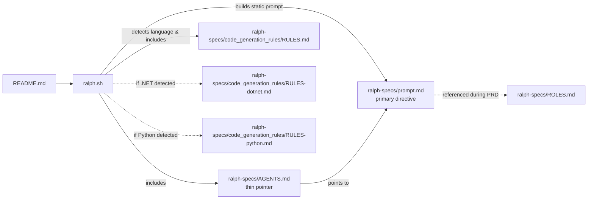

# Ralph


Ralph is an autonomous AI agent loop that runs AI coding tools (OpenCode by default, or [Amp](https://ampcode.com)/[Claude Code](https://docs.anthropic.com/en/docs/claude-code)) repeatedly until all PRD items are complete. Each iteration is a fresh instance with clean context. Memory persists via git history, `progress.md`, and `tasks.json`.

Based on [Geoffrey Huntley's Ralph pattern](https://ghuntley.com/ralph/).

[Read my in-depth article on how I use Ralph](https://x.com/ryancarson/status/2008548371712135632)

All project dependency installation, linting, testing, builds, and database seeding must run inside containers (Docker/Podman/Compose). Keep the host clean of project toolchains. For images that need outbound network access, include the certificate install RUN block from `ralph/resources/Dockerfile.dotnet`/`ralph/resources/Dockerfile.template` to ensure proxy/interception certs are trusted. Do not link directly to files in `ralph/resources`; copy the needed content into the target project because that code has no access to runner-only files (they are not secret).

**Path boundaries (very important):** On startup Ralph sets two roots and keeps them separate:
- `RALPH_ROOT`: the runner checkout; all runner-owned instructions, prompts, rules, and resources live here. Nothing is written inside `RALPH_ROOT` at runtime.
- `TARGET_REPO_ROOT`: the project repository you pass via `--target-repo`; all PRD/task/progress/suggestions files live under this root (e.g., `TARGET_REPO_ROOT/.ralph/tasks.json`).
Ralph reads runner files only from `RALPH_ROOT` and writes all iteration artifacts only under `TARGET_REPO_ROOT`. Avoid mixing paths to prevent missing-file confusion at runtime. Do not target the runner repo itself as the `--target-repo`; the script will exit to prevent writing into `RALPH_ROOT`.

## Prerequisites

- Docker or Podman with Compose support (all installs/tests/builds run in containers)
- One of the following AI coding tools installed and authenticated on the host (OpenCode is the default):
  - OpenCode CLI
  - [Amp CLI](https://ampcode.com)
  - [Claude Code](https://docs.anthropic.com/en/docs/claude-code) (`npm install -g @anthropic-ai/claude-code`)
- `jq` installed on the host (`brew install jq` on macOS)
- A git repository for your project

Project dependencies, linting, testing, builds, and database seeding must be executed via container entrypoints (e.g., `docker compose run` / `podman compose run`). Do not install project toolchains on the host.

### Pushover Notifications (Optional)

Ralph can send push notifications via [Pushover](https://pushover.net) when the loop terminates (all tasks complete, agent stop, max iterations, or errors) and when the PRD skill finishes generating specs.

Set these environment variables to enable notifications:

```bash
export PUSHOVER_TOKEN="your-pushover-app-token"
export PUSHOVER_USER_KEY="your-pushover-user-key"
```

Optional variables:
- `PUSHOVER_DEVICE` - target a specific device (default: all)
- `PUSHOVER_SOUND` - notification sound name (default: pushover)

If the variables are not set, notifications are silently skipped. The script `scripts/notify.sh` can also be called standalone for custom notifications.

## Setup

### Option 1: Copy to your project

Copy the ralph files into your project:

```bash
# From your project root
mkdir -p scripts/ralph
cp /path/to/ralph/ralph.sh scripts/ralph/

# Copy the prompt template:
cp /path/to/ralph/ralph-specs/prompt.md scripts/ralph/prompt.md

chmod +x scripts/ralph/ralph.sh
```

Run project commands through container entrypoints (docker compose / podman compose). Keep project dependencies out of the host.

Minimal dry run: a sample PRD lives at `.ralph/tasks.json` with `branchName` `ralph/example`. Switch to that branch, then run `./ralph.sh --target-repo $(pwd)` to exercise the loop end-to-end.

When you start a new PRD (or edit the current `tasks.json`), Ralph auto-archives the previous run’s `tasks.json` and `progress.md` into `archive/YYYY-MM-DD-<branch>/` and resets `progress.md` so each requirement set stays isolated.

### Option 2: Install skills globally (Amp/Claude)

Copy the skills to your Amp or Claude config for use across all projects:

For AMP
```bash
cp -r skills/prd ~/.config/amp/skills/
cp -r skills/ralph_prd ~/.config/amp/skills/
```

For Claude Code (manual)
```bash
cp -r skills/prd ~/.claude/skills/
cp -r skills/ralph_prd ~/.claude/skills/
```

### Configure Amp auto-handoff (recommended)

Add to `~/.config/amp/settings.json`:

```json
{
  "amp.experimental.autoHandoff": { "context": 90 }
}
```

This enables automatic handoff when context fills up, allowing Ralph to handle large stories that exceed a single context window.

## Workflow

### 1. Create a PRD

Use the PRD skill to generate a detailed requirements document:

```
Load the prd skill and create a PRD for [your feature description]
```

Answer the clarifying questions. The skill saves output to `.ralph/prds/NNNN-prd-[feature-name].md` and `.ralph/tasks.json`.

Before finalizing, take a high-level pass across all tasks: make sure they fit together, reorder them if dependencies or narrative flow suggest a better sequence, and promote any oversized subtasks into standalone tasks, then re-run the overview and ordering.

### 2. Convert PRD to Ralph format

Use the Ralph skill to convert the markdown PRD to JSON:

```
Load the ralph skill and convert prds/NNNN-prd-[feature-name].md to tasks.json
```

This creates `.ralph/tasks.json` with tasks structured for autonomous execution.

### Quick start (minimal example)

```bash
# 1) Create PRD (interactive, uses prd skill)
Load the prd skill and create a PRD for "[your feature description]". It writes `.ralph/prds/NNNN-prd-[feature].md` and `.ralph/tasks.json`.

# 2) (optional legacy) Convert existing PRD to JSON
If you have an older markdown PRD, convert it to `.ralph/tasks.json` using the ralph skill; save the markdown under `.ralph/prds/`.

# 3) Run Ralph against your project repo
./ralph.sh --target-repo /path/to/your/repo
```

### 3. Run Ralph

```bash
# Using OpenCode (default)
./scripts/ralph/ralph.sh [max_iterations]

# Using Amp
./scripts/ralph/ralph.sh --tool amp [max_iterations]

# Using Claude Code
./scripts/ralph/ralph.sh --tool claude [max_iterations]

# Host mode (skip containers, use host-installed tools)
./scripts/ralph/ralph.sh --host-mode [max_iterations]
```

Default is 30 iterations. Use `--tool amp` or `--tool claude` to override the default OpenCode tool. Use `--host-mode` when tools are installed locally and you want to skip container overhead.

Ralph will:
1. Create a feature branch (from PRD `branchName`)
2. Build the instruction prompt once (instructions + language-specific rules)
3. Pick the next task where `passes: false` based on dependency/implementation flow
4. Inject the selected task JSON and recent progress into the prompt
5. Implement that single task
6. Run quality checks (in containers by default, or on host with `--host-mode`)
7. Commit if checks pass
8. Update `.ralph/tasks.json` to mark the task as `passes: true`
9. Append learnings to `.ralph/progress.md`
10. Repeat until all tasks pass or max iterations reached

## Key Files

| File | Purpose |
|------|---------|
| `ralph.sh` | The bash loop that spawns fresh AI instances (supports `--tool opencode|amp|claude`, default OpenCode) |
| `ralph-specs/prompt.md` | Prompt template for the AI tool |
| `.ralph/tasks.json` | PRD-backed tasks with `passes` status (the task list) |
| `.ralph/progress.md` | Append-only learnings for future iterations |
| `tasks.json.example` | Example PRD format for reference |
| `.ralph/suggested_improvements.md` | Suggestions to improve the Ralph runner/prompts/process (lives in the target repo; do not write inside the runner) |
| `scripts/notify.sh` | Pushover notification helper (requires `PUSHOVER_TOKEN` and `PUSHOVER_USER_KEY` env vars) |
| `skills/prd/` | Skill for generating PRDs (works with Amp and Claude Code) |
| `skills/ralph_prd/` | Skill for converting PRDs to JSON (works with Amp and Claude Code) |

## Documentation Dependency Map



## Critical Concepts

### Each Iteration = Fresh Context

Each iteration spawns a **new AI instance** (OpenCode/Amp/Claude Code) with clean context. The only memory between iterations is:
- Git history (commits from previous iterations)
- `progress.md` (learnings and context)
- `tasks.json` (which stories are done)

### Small Tasks

Each PRD item should be small enough to complete in one context window. If a task is too big, the LLM runs out of context before finishing and produces poor code.

Right-sized stories:
- Add a database column and migration
- Add a UI component to an existing page
- Update a server action with new logic
- Add a filter dropdown to a list

Too big (split these):
- "Build the entire dashboard"
- "Add authentication"
- "Refactor the API"

### Codebase Pattern Analysis (keyFiles & implementationNotes)

During PRD creation, the **Codebase Pattern Analyst** role (Role 5) reads the target codebase and populates two optional fields on each task in `tasks.json`:

- **`keyFiles`** — array of file paths relevant to the task (files to read, create, or modify). New files include a `(create new)` suffix. These are hints, not guarantees; paths may shift between PRD creation and execution.
- **`implementationNotes`** — concise guidance on how to implement: which patterns to follow, reference implementations, naming conventions, and test file locations.

These fields let iteration agents skip the file discovery phase and start implementing immediately. When present, the agent reads `keyFiles` first and follows `implementationNotes` before doing any broad codebase scans.

### AGENTS.md Updates Are Critical

After each iteration, Ralph updates the relevant `AGENTS.md` files with learnings. This is key because AI coding tools automatically read these files, so future iterations (and future human developers) benefit from discovered patterns, gotchas, and conventions.

Examples of what to add to AGENTS.md:
- Patterns discovered ("this codebase uses X for Y")
- Gotchas ("do not forget to update Z when changing W")
- Useful context ("the settings panel is in component X")

### Feedback Loops

Ralph only works if there are feedback loops:
- Typecheck catches type errors
- Tests verify behavior
- CI must stay green (broken code compounds across iterations)

### Browser Verification for UI Stories

Frontend stories must include "Verify in browser using dev-browser skill" in acceptance criteria. Ralph will use the dev-browser skill to navigate to the page, interact with the UI, and confirm changes work.

### Stop Condition

When all stories have `passes: true`, Ralph outputs `<promise>COMPLETE</promise>` and the loop exits.

## Debugging

Check current state:

```bash
# See which stories are done
cat .ralph/tasks.json | jq '.tasks[] | {id, title, passes}'

# See learnings from previous iterations
cat progress.md

# Check git history
git log --oneline -10
```

## Customizing the Prompt

After copying `ralph-specs/prompt.md` to your project, customize it for your project:
- Add project-specific quality check commands
- Include codebase conventions
- Add common gotchas for your stack

## Archiving

Ralph automatically archives previous runs when you start a new feature (different `branchName`). Archives are saved to `archive/YYYY-MM-DD-feature-name/`.

## References

- [Geoffrey Huntley's Ralph article](https://ghuntley.com/ralph/)
- [Amp documentation](https://ampcode.com/manual)
- [Claude Code documentation](https://docs.anthropic.com/en/docs/claude-code)
